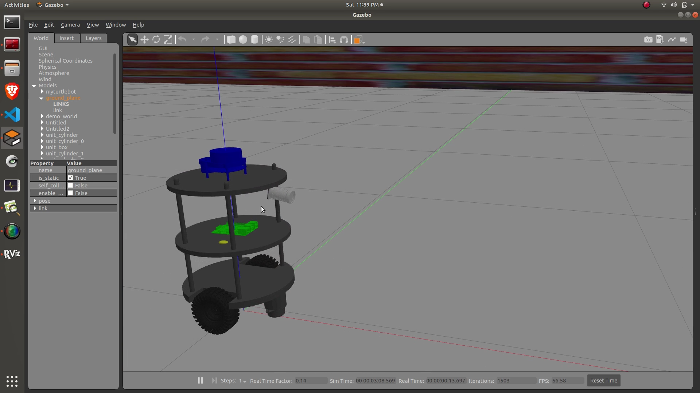

# Custom-Autonomous-Mobile-Robot
This repository contains files for ROS based custom Autonomous Mobile Robot


## I. DIY Guide

### System Requirements
* Ubuntu Linux 18.04
* [ROS Melodic](http://wiki.ros.org/melodic/Installation/Ubuntu)
* Python 3.6 or above

### Installation and Setup
* Clone this repository to ```src``` folder of your catkin workspace using following commands
```
git clone https://github.com/kakadeniranjan1999/Custom-Autonomous-Mobile-Robot.git
```
* Move ```myturtlebot``` directory one level up using following commands
```
cd Custom-Autonomous-Mobile-Robot
mv * ../
```
* Move to your catkin workspace
```
cd ../../
```
* Install package dependencies using following command
```
rosdep install --from-paths . --ignore-src --rosdistro melodic -y
```
* Build the package
```
catkin build myturtlebot
```

### Usage
* Run [gazebo.launch](myturtlebot/launch/gazebo.launch) file
```
roslaunch myturtlebot gazebo.launch
```
* Run [amcl.launch](myturtlebot/launch/amcl.launch) file
```
roslaunch myturtlebot amcl.launch
```
* Run [move_base.launch](myturtlebot/launch/move_base.launch) file
```
roslaunch myturtlebot move_base.launch
```
* Set the pose of the robot using ```2D Pose Estimate``` and provide a goal to the robot using ```2D Nav Goal```  from RViz GUI.
* Follow the demo video if any queries
    [](https://drive.google.com/file/d/1b0HTurkjzlNU9HafmBCwLxoVWh6kYR2C/view?usp=sharing)
